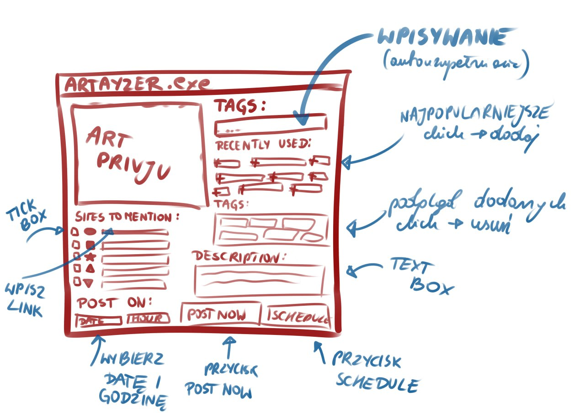
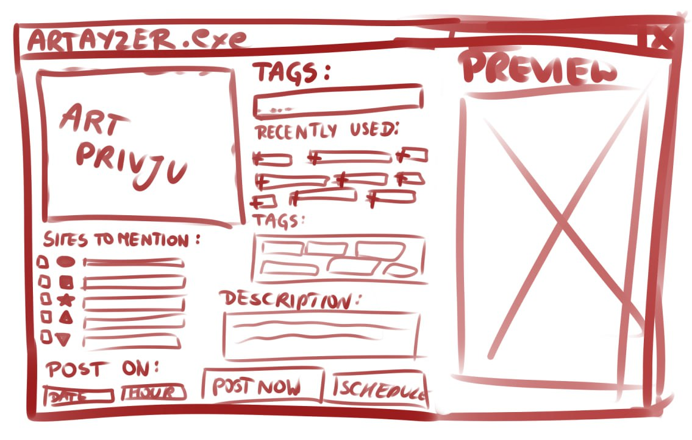

# Telegram Post Scheduler
A simple GUI app for scheduling telegram posts and parsing post description based on common template.

## Purpose
This app is meant to be a really simple app that can do a one job - let the user send or schedule a telegram post to the specific channel containing an image and a description that can be parsed inside this app following a common template and using a few text fields. It should be also possible to use this app only to parse the description without sending the post for manual post creation inside the telegram (as telegram bots still don't support gallery posts).

## GUI sketch



## Prepare environment locally

To run this app locally you need to install the required python modules that are listed in `requirements.txt`.

The suggested method is to create a python venv, source it and install modules inside the `venv` to avoid modifying your main python system env.

```bash
python -m venv ./venv
source venv/bin/activate
pip install -r requirements.txt
```
